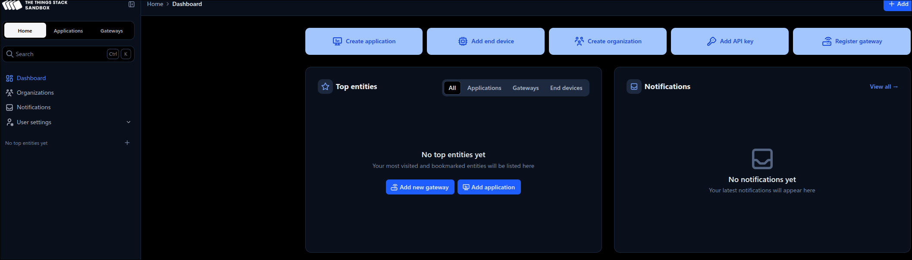
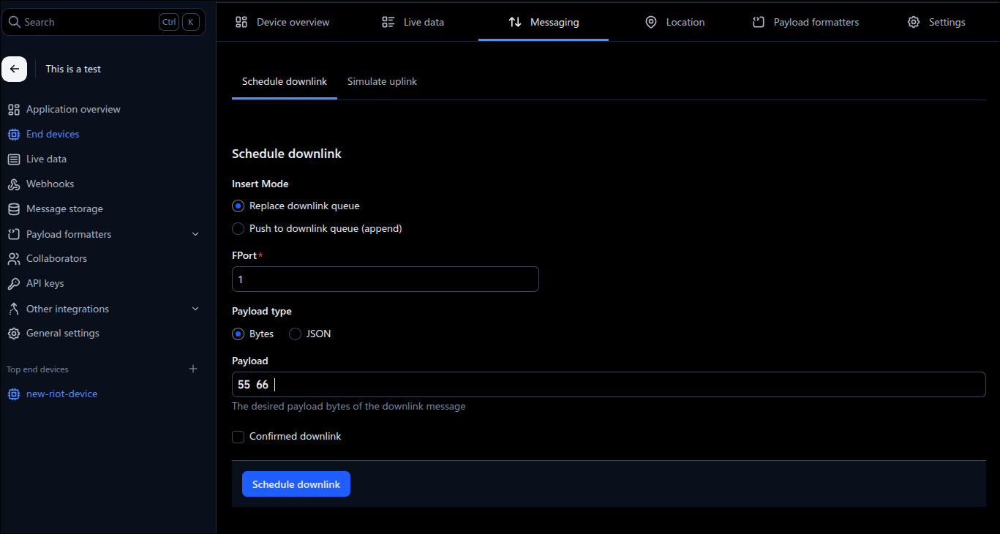

# LoRaWAN

LoRaWAN is a Media Access Control (MAC) layer protocol built on top of LoRa modulation.
It is a software layer which defines how devices use the LoRa hardware, for example when they transmit, and the format of messages. The LoRaWAN protocol is developed and maintained by the LoRa Alliance.

The Things Network is powered by The Things Stack, which is a LoRaWAN network server that receives messages from LoRaWAN devices.

To change to this directory from a different exercise, use the following command in the terminal.

```sh
$ cd ../11-lorawan
```

## Task 1

1. With your browser access The Things Network at [https://www.thethingsnetwork.org/](https://www.thethingsnetwork.org/),
and create an account for yourself by clicking on the "Sign Up" button.

2. Once you have an account, navigate to the console at [https://console.cloud.thethings.network/](https://console.cloud.thethings.network/), and choose the "Europe 1" cluster.

    

3. On your console, start the creation of a new application, by clicking "Create application".

    

4. Set your application ID and description, then confirm with "Create application".

    

5. From the panel that shows your application overview, click on "+ Register end device", inside the "End devices" section.

    

6. To register the device, choose to "Enter end device specifics manually", so we can provide the configuration. Follow this configuration, make sure to "Show advanced activation, LoRaWAN class and cluster settings":

    | Parameter | Value |
    | --------- | ----- |
    | Frequency plan | "Europe 863-870 MHz (SF9 for RX2 - recommended)" |
    | LoRaWAN version | "LoRaWAN Specification 1.0.3" |
    | Regional Parameters version | "RP001 Regional Parameters 1.0.3 revision A" |
    | Activation mode | "Over the air activation (OTTA)" |
    | Additional LoRaWAN class capabilities | "None (class A only)" |
    | Use network's default MAC settings | True |
    | Join EUI | `00 00 00 00 00 00 00 00` |

    

7. Once you entered the Join EUI, click on "Confirm". Generate the DevEUI and AppKey by clicking on "Generate".
8. Enter a unique name for your device, and click on "Register end device"
9. From the device overview panel, copy the "AppEUI", "DevEUI", and "AppKey" values, and replace them in the `Makefile` of this exercise.

## Task 2

1. To be able to send data, we first need to determine which network interface to use. We can iterate the register of network interfaces, until we find the one that has a LoRa device (in our case the device will have also a IEEE802.15.4 radio as a second interface). We need to implement `find_lorawan_network_interface` in `main.c`. The function should return a pointer to the first found lora interface. We start by initializing local variables:
    ```C
    netif_t *netif = NULL;
    uint16_t device_type = 0;
    ```
We need to iterate the register and for each interface check the device type. In case we finish the iteration and didn't find a valid interface, the returned value should be `NULL`:
    ```C
    do {
        netif = netif_iter(netif);
        if (netif == NULL) {
            puts("No network interface found");
            break;
        }
        netif_get_opt(netif, NETOPT_DEVICE_TYPE, 0, &device_type, sizeof(device_type));
    } while (device_type != NETDEV_TYPE_LORA);

    return netif;
    ```

2. Now that we found the correct interface, we need to join the network. We'll be using the [OTAA join method](https://www.thethingsnetwork.org/docs/lorawan/end-device-activation/#over-the-air-activation-in-lorawan-10x).
    We'll implement the `join_lorawan_network` function, which receives the interface that was found before.
    The procedure is:
    - iteratively attempt to join the network.
    - wait for a few seconds.
    - check the result.

    ```C
    netopt_enable_t status;
    uint8_t data_rate = 5;

    while (1) {
        status = NETOPT_ENABLE;
        printf("Joining LoRaWAN network...\n");
        ztimer_now_t timeout = ztimer_now(ZTIMER_SEC);
        netif_set_opt(netif, NETOPT_LINK, 0, &status, sizeof(status));

        while (ztimer_now(ZTIMER_SEC) - timeout < 15000) {
            /* Wait for a while to allow the join process to complete */
            ztimer_sleep(ZTIMER_SEC, 1);

            netif_get_opt(netif, NETOPT_LINK, 0, &status, sizeof(status));
            if (status == NETOPT_ENABLE) {
                printf("Joined LoRaWAN network successfully\n");

                /* Set the data rate */
                netif_set_opt(netif, NETOPT_LORAWAN_DR, 0, &data_rate, sizeof(data_rate));

                /* Disable uplink confirmation requests */
                status = NETOPT_DISABLE;
                netif_set_opt(netif, NETOPT_ACK_REQ, 0, &status, sizeof(status));
                return;
            }
        }
    }
    ```

3. Finally, we can send data via LoRaWAN whenever we read a new temperature value. For this, implement `send_lorawan_packet`.
    First, get both bytes representing the temperature value:

    ```C
    data[0] = temperature->val[0] >> 8; // High byte
    data[1] = temperature->val[0] & 0xFF; // Low byte
    ```

    Then, create a new packet buffer for our data:
    ```C
    packet = gnrc_pktbuf_add(NULL, &data, sizeof(data), GNRC_NETTYPE_UNDEF);
    if (packet == NULL) {
        puts("Failed to create packet");
        return -1;
    }
    ```

    As the send operation doesn't block our thread, we need to subscribe to the events
    generated by the payload snippet. This way, we can wait until the network stack has
    processed our packet and confirmed its transmission. We use the error reporting API.

    ```C
    if (gnrc_neterr_reg(packet) != 0) {
        puts("Failed to register for error reporting");
        gnrc_pktbuf_release(packet);
        return -1;
    }
    ```

    Now, we need a packet header:
    ```C
    header = gnrc_netif_hdr_build(NULL, 0, &address, sizeof(address));
    if (header == NULL) {
        puts("Failed to create header");
        gnrc_pktbuf_release(packet);
        return -1;
    }
    ```

    As a last step, we add the header to the buffer:
    ```C
    packet = gnrc_pkt_prepend(packet, header);
    netif_header = (gnrc_netif_hdr_t *)header->data;
    netif_header->flags = 0x00;
    ```

    We can now trigger the transmission of the packet:

    ```C
    result = gnrc_netif_send(container_of(netif, gnrc_netif_t, netif), packet);

    if (result < 1) {
        printf("error: unable to send\n");
        gnrc_pktbuf_release(packet);
        return 1;
    }
    ```

    We want to wait until the network stack confirms that the packet has been
    sent. This indication will arrive to the message queue.

    ```C
    /* wait for transmission confirmation */
    msg_receive(&msg);
    if (msg.type != GNRC_NETERR_MSG_TYPE) {
        printf("error: unexpected message type %" PRIu16 "\n", msg.type);
        return -1;
    }
    if (msg.content.value != GNRC_NETERR_SUCCESS) {
        printf("error: unable to send, error: (%" PRIu32 ")\n", msg.content.value);
        return -1;
    }

    return 0;
    ```

4. We're sending our temperature encoded in a particular way. To actually see the data
    in the correct format on the "Live Data" tab of the things network dashboard, we need
    to implement a payload formatter. This will receive all uplink data, and allow us to
    operate on it to parse it according to our application logic.

    Navigate the the "Payload formatters" tab of the dashboard, and select
    "Custom Javascript formatter" in the "Formatter type" dropdown. In the formatter code,
    place the following snippet, which takes the individual bytes, arranges them into a
    two-bytes integer, and scales it to deg. Celsius.

    ```js
    function decodeUplink(input) {
        return {
            data: {
            temperature: (input.bytes[0] << 8 | input.bytes[1]) / 100.0
            },
            warnings: [],
            errors: []
        };
    }
    ```

Upon boot, your node should be able to join the LoRaWAN network and start sending the
temperature data from its sensor.

## Task 3

We can already send data to the LoRaWAN server, now we want to be able to receive
downlinks from it. In typical deployments, the nodes will be sending more uplinks than
receiving downlinks. In fact, our node is of type A, which means that a downlink is only
possible right after an uplink.

To keep our firmware responsive, we're going to use a thread to handle the packet
receptions. If you want more details on RIOT threads, check the
[exercise 06](../06-threads/README.md). The reception thread will create a message queue,
and register it to the network stack, so it gets notified when new events occur. Every
time a new packet is received, we'll print its content.

1. We first create the reception thread. We can simply call `thread_create` after we
have joined the network.

    ```C
    kernel_pid_t rx_pid = thread_create(_rx_thread_stack, sizeof(_rx_thread_stack),
                                        THREAD_PRIORITY_MAIN - 1,
                                        THREAD_CREATE_STACKTEST, rx_thread, NULL,
                                        "lorawan_rx");
    if (-EINVAL == rx_pid) {
        puts("Failed to create reception thread");
        return -1;
    }
    ```

2. We need to make sure that the network stack notifies the thread of events.
For this, we register to the GNRC netreg with the thread's PID.

    ```C
    gnrc_netreg_entry_t entry = GNRC_NETREG_ENTRY_INIT_PID(GNRC_NETREG_DEMUX_CTX_ALL,
                                                        rx_pid);
    gnrc_netreg_register(GNRC_NETTYPE_UNDEF, &entry);
    ```

3. Now that the network stack will send messages to the thread, we need to be prepared to
receive them. We'll be using one of RIOT's synchronization primitives:
[messages](https://doc.riot-os.org/group__core__msg.html). First, define the queue where
messages are received. Define this at the beginning of `main.c`.

    ```C
    static msg_t _rx_msg_queue[RX_QUEUE_SIZE];
    ```

4. Inside the reception thread function (`rx_thread`), initialize the queue once, outside
the infinite loop.

    ```C
    msg_init_queue(_rx_msg_queue, RX_QUEUE_SIZE);
    ```

5. In the loop, we want to wait for new messages. We can call `msg_receive`, which will
block the thread until a new message arrives to the queue.

    ```C
    msg_receive(&msg);
    ```

6. Whenever we receive a new message of the type `GNRC_NETAPI_MSG_TYPE_RCV`, it means that
a new packet has been received, and we need to process it.

    ```C
    if (msg.type == GNRC_NETAPI_MSG_TYPE_RCV) {
        puts("Received data");
        gnrc_pktsnip_t *pkt = msg.content.ptr;
        _print_received_packet(pkt);
    }
    ```

7. For this exercise we'll print the packet to STDOUT. In a real application you'd parse
the content to act upon it. Each packet in the network stack will be represented as a
linked list of packet snippets. We need to iterate them and print the one that has the
payload data. We can identify this snippet by the type `GNRC_NETTYPE_UNDEF`. Implement
the function `_print_received_packet`.

    ```C
    /* iterate over all packet snippets */
    while (snip != NULL) {
        /* LoRaWAN payload will have 'undefined' type */
        if (snip->type == GNRC_NETTYPE_UNDEF) {
            od_hex_dump(((uint8_t *)pkt->data), pkt->size, OD_WIDTH_DEFAULT);
        }
        snip = snip->next;
    }

    /* always release the packet buffer to prevent memory leaks */
    gnrc_pktbuf_release(pkt);
    ```

8. We should be able to receive downlinks from the application now! To schedule a new
downlink message (which is sent after the next uplink), navigate to your device's
dashboard in the things network, and click in the 'Messaging' tab. There, set a payload
in the `Payload` field. The values need to be encoded in hexadecimal. Keep the packet a
few bytes long (e.g., `55 66`). Click on 'Schedule downlink'.

    
